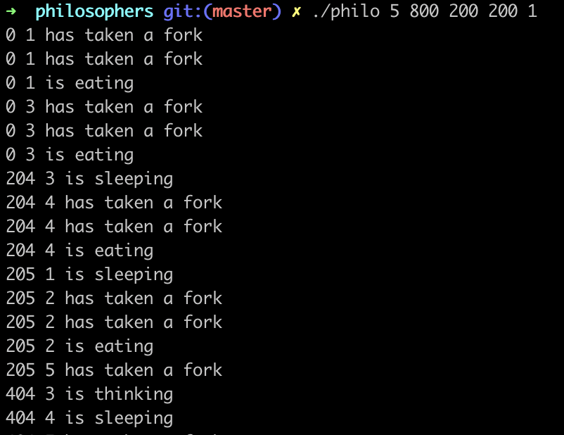

#PHILOSOPHERS

This project is solving of fundamental resource starvation task.
This task was firstly formulated by Edsger Dijkstra in 1965.
To learn more about the problem you can read this article: https://en.wikipedia.org/wiki/Dining_philosophers_problem

In short words: you have some threads and the same amount of mutexes. Every thread must do some actions (eat) for some time and then give resources to another one (first one is sleeping during this time).

One philo is a thread amd one fork is a mutex.

There mustn't be a deadlock. A philo must report about a death if start to starving.

Usage:
1. "git clone https://github.com/toradziro/philosophers"
2. "make" in root project's directory
3. "./philo 5 800 200 200" - where 5 is number of philos, 800 is time philo can live without eating, 200 is time philo needs to eat, 200 is time for philo to sleep.

All time is counted in microseconds. Also program may have one optional parameter as "./philo 5 800 200 200 3" where 3 means how many times every philo must it and then simulation stops.

To complete this task I used a "pthread" library.

Output looks like that:

1. Time since start of simulation.
2. Philosopher ID.
3. Commited action.

